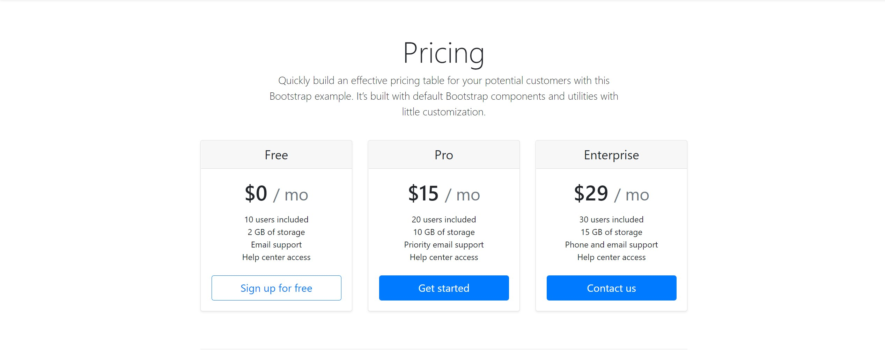

# Cards

Készítsd el bootstrap segítésével a képen látható kártyás oldalt:
  
A kártyák *md* töréspontig egymás alatt vannak, *md* törésponttól egymás mellé kerülnek.

A designnak nem kell pixelpontosnak lennie!