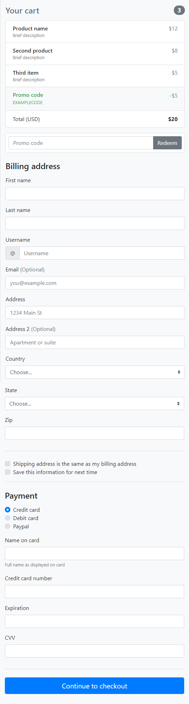

# Checkout form

Készítsd el bootstrap segítésével a képen látható formot.   
*sm* töréspontig az elrendezés az alábbiak szerint alakul:  
   
*sm* töréspont felett pedig:  
   

A *state* mezőnél elég 5 darab példaországot felvenni.   

A designnak nem kell pixelpontosnak lennie!