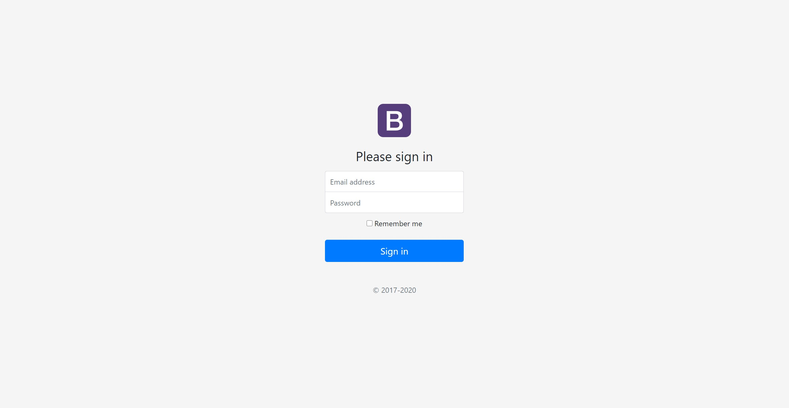

# Login screen

Készítsd el bootstrap segítésével a képen látható login screent:

A designnak nem kell pixelpontosnak lennie.   
A login box mind vertikálisan, mind horizontálisan középre van igazítva!
Az ikont neked kell elkészítened, a háttérszíne és a betűtípus szabadon válaszható, a betű a keresztneved kezdőbetűje legyen. Ne button használj, hanem egyedi design-t készíts!  

A designnak nem kell pixelpontosnak lennie!